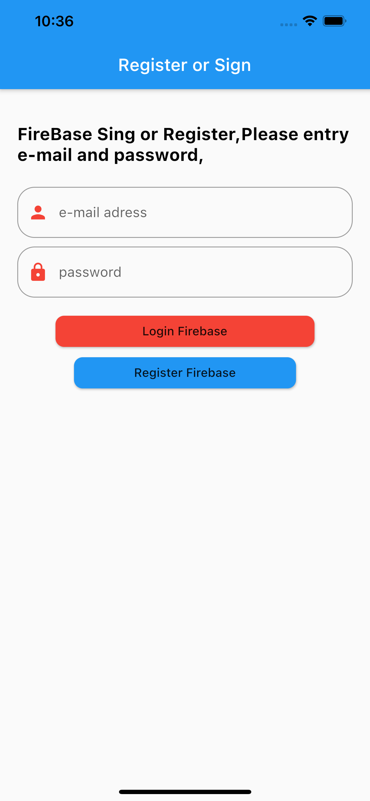

# fire_base

Flutter IOS firebase register and login

## App Home


## Podfile changes
ios/Podfile => platform :ios, '10.0'

```yaml
firebase_core:
firebase_auth:
```

## main app initialized

```dart
Future<void> main() async{
  WidgetsFlutterBinding.ensureInitialized();
  await Firebase.initializeApp();
  runApp(MyApp());
}
```

## Service

```dart
import 'dart:developer';

import 'package:fire_base/models/user_model.dart';
import 'package:firebase_auth/firebase_auth.dart';

class AuthFirebase {
  /// Firebase initialized
  FirebaseAuth _auth = FirebaseAuth.instance;

  /// Register with email and password
  Future registerUserWithEmailandPassword(
      String? email, String? password) async {
    try {
      UserCredential userCredential =
          await FirebaseAuth.instance.createUserWithEmailAndPassword(
        email: email!,
        password: password!,
      );
    } on FirebaseAuthException catch (e) {
      if (e.code == 'weak-password') {
        print('The password provided is too weak.');
      } else if (e.code == 'email-already-in-use') {
        print('The account already exists for that email.');
      }
    } catch (e) {
      log(e.toString());
    }
  }

  /// Sign in with email and password
  Future singUserWithEmailandPassword(String? email, String? password) async {
    try {
      UserCredential userCredential =
          await FirebaseAuth.instance.signInWithEmailAndPassword(
        email: email!,
        password: password!,
      );
      final User user = userCredential.user!;
      return _userFromFirebase(user);
    } on FirebaseAuthException catch (e) {
      if (e.code == 'user-not-found') {
        print('No user found for that email.');
      } else if (e.code == 'wrong-password') {
        print('Wrong password provided for that user.');
      }
    }
  }

  /// SignOut
  Future singOut() async {
    await FirebaseAuth.instance.signOut();
  }

  /// App Model
  UserModel? _userFromFirebase(User? user) {
    return user != null ? UserModel(uid: user.uid, email: user.email!) : null;
  }

  /// Provider sign in or sign out listen
  Stream<UserModel?> get user {
    return _auth.authStateChanges().map(_userFromFirebase);
  }
}
```


## Getting Started

This project is a starting point for a Flutter application.

A few resources to get you started if this is your first Flutter project:

- [Lab: Write your first Flutter app](https://flutter.dev/docs/get-started/codelab)
- [Cookbook: Useful Flutter samples](https://flutter.dev/docs/cookbook)

For help getting started with Flutter, view our
[online documentation](https://flutter.dev/docs), which offers tutorials,
samples, guidance on mobile development, and a full API reference.
